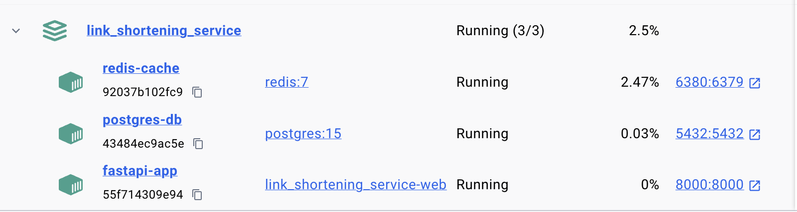
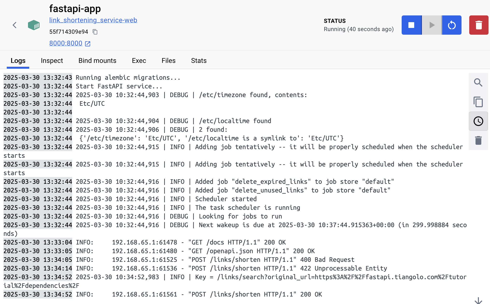
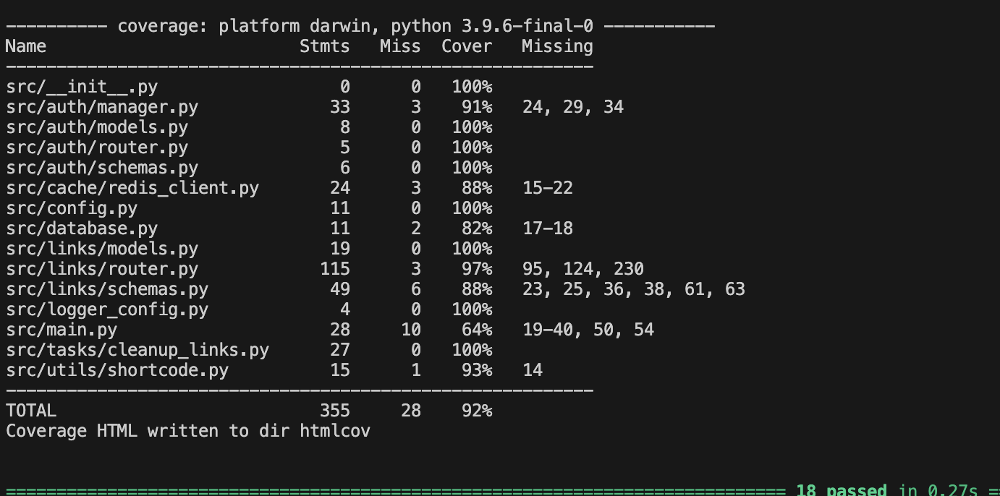
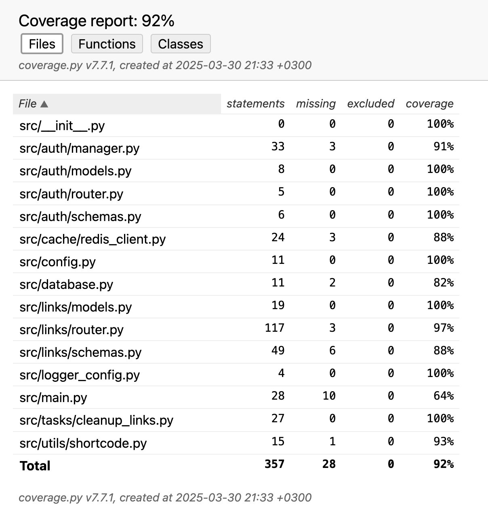

# ДЗ-3/4 продвинутый python ИИ24
Сушкова Дарья Сергеевна<br>
FastApi веб-сервис сокращения ссылок.

### Структура проекта
Код сервиса расположен в директории `/src`:
- `/auth`: функциональность авторизациии внутри сервиса;
- `/cache`: реализация функций кэширования через клиента Redis;
- `/links`: функциональность взаимодействия с сущностью ссылок;
- `/tasks`: функции шедулера, выполянемые по расписанию;
- `/utils`: утилитарные функции, связанные с генерацией коротких ссылок;
- `/config.py`: определение переменных среды;
- `/database.py`: асинхронное взаимодействие с базой данных;
- `/logger_config.py`: логгер, используемый в рамках сервиса;
- `/main.py`: точка входа в сервис.

В директории `/migrations` расположены файлы, связанные с миграциями, реализованными через `alembic`.<br>
В директории `/docker` расположен файл запуска в рамках деплоя через `docker-compose`.<br>
В директории `/images` расположены вспомогательные картинки для данного README.<br>
В директории `/tests` расположены тесты для сервиса.

### Описание API
На скрине представлена Swagger документация для сервиса FastAPI:<br>

Для регистрации нового пользователя нужно использовать ручку `auth/register`, указав email и пароль. А для login/logout советуется использовать специальную кнопку `Authorize` (особенности реализации библиотеки `fastapi-users`).<br>
Основной функционал сервиса представлен в доменном имени `/links` и содержит ручки:
- `POST /links/shorten`: создание новой короткой ссылки. Обазытельно указать оригинальную ссылку, опционально - кастомный алиас и время жизни ссылки. Значение алиаса не может быть `search` (во избежание конфликтов между endpoints) и должно содержать только буквы или цифры. Значения коротких ссылок проверяются на уникальность. Пример request body:
```json
{
  "original_url": "https://ru.wikipedia.org/wiki/Заглавная_страница",
  "custom_alias": "wiki",
  "expires_at": "2025-03-29T09:50:01.120Z"
}
```
- `GET /links/search`: поиск всех коротких ссылок, привязанных к оригинальному url. Пример запроса:
```
/links/search?original_url=https://ru.wikipedia.org/wiki/Заглавная_страница
```
- `GET /links/{short_code}`: редирект по короткой ссылке, направляющий на оригинальный url. Пример запроса - `/links/wiki`;
- `PUT /links/{short_code}`: изменение состояния короткой ссылки - назначение нового url. Пример request body для запроса `/links/wiki`:
```json
{
  "original_url": "https://ru.wikipedia.org/wiki/LOL"
}
```
- `DELETE /links/{short_code}`: удаление связи по короткой ссылке. Пример запроса - `/links/wiki`;
- `GET links/{short_code}/stats`: получение статистики по короткой ссылке - оригинальный url, дата и время создания, количество переходов (через ручку редиректа), последнее время перехода, дата и время истечения срока жизни ссылки. Пример запроса - `links/wiki/stats`.

Помимо успешных статусов с кодом 200 сервис отдает ошибочные статусы, например:
- `400 Bad Request`: некорректные параметры запроса (например, повторяющийся кастомный алиас),
- `401 Unauthorized`: попытка выполнить запросы на изменение / удаление неавторизованным пользователем,
- `402 Unprocessable Entity`: некорректные значения url / алиаса (реализованы кастомные валидаторы),
- `403 Forbidden`: доступ на редактирование / удаление ссылки отсутствует,
- `404 Not Found`: ссылка не найдена в базе данных.

### Описание БД
В качестве основного хранилища используется Postgres, в котором две таблицы:
1. users (зарегистрированные пользователи) - используется базовая модель из `fastapi-users`:<br>
| Поле | Описание |
|-------------|-------------|
| user_id | Идентификатор (uuid) пользователя |
| email | Email пользователя |
| hashed_password | Захэшированный пароль |
| is_active | Флаг активности (по умолчанию true) |
| is_superuser | Флаг админа (по умолчанию false) |
| is_verified | Флаг верификации (по умолчанию false) |
2. links (сгенерированные сервисом короткие ссылки):<br>
| Поле | Описание |
|-------------|-------------|
| id | Идентификатор (uuid) ссылки |
| short_code | Значение короткой ссылки |
| original_url | Оригинальный URL |
| user_id | Идентификатор (uuid) пользователя |
| created_at | Дата и время создания |
| clicks_count | Количество переходов |
| last_clicked_at | Последний переход из сервиса |
| expires_at | Дата и время жизни ссылки |

Все временные колонки с указанием таймзоны для гибкости работы сервиса.

### Кэширование данных
Кэширование реализовано на GET endpoint-ах, что помогает оптимизировать:
- получение списка коротких ссылок по оригинальному URL (`/links/search?original_url={url}`), время хранения равно 5 минутам;
- редирект по короткой ссылке (`/links/{short_code}`), время хранения равно 1 минуте;
- получение статистики по короткой ссылке (`/links/{short_code}/stats`), время хранения равно 1 минуте.
<br>
Реализован кастомный `key_builder`, который формирует ключ в Redis по заданному шаблону:
```
{request.url.path}?{request.url.query}
```

Реализовано удаление кэшей при изменении состояния короткой ссылки, а именно:
- создание короткой ссылки (`POST /links/shorten`) - очистка кэша с ключами вида `short_links_cache:/links/search?original_url={url}`, так как список коротких ссылок может пополниться для уже кэшированного URL;
- обновление URL короткой ссылки (`PUT /links/{short_code}`) - очистка кэша с ключами вида `short_links_cache:/links/search?original_url={url}` (для старого и нового URL), `short_links_cache:/links/{short_code}` и `short_links_cache:/links/{short_code}/stats?`;
- удаление короткой ссылки (`DELETE /links/{short_code}`) - очистка кэша с ключами вида `short_links_cache:/links/search?original_url={url}`, `short_links_cache:/links/{short_code}` и `short_links_cache:/links/{short_code}/stats?`.

### Планировщики запросов
Scheduling, реализованный с помощью `AsyncIOScheduler`, используется в рамках запуска запланированных задач для очистки данных в БД, а именно:
1. Удаление ссылок с истекшим сроком жизни (определяется по полю `expires_at`). Задача запускается раз в 5 минут.
2. Удаление неиспользуемых ссылок (определяется по полю `last_clicked_at`). Задача запускается раз в 12 часов и удаляет ссылки, которые не использовались за последние 30 дней.

### Деплой и запуск приложения
Деплой сервиса реализован с помощью `docker-compose.yml`, который определяет три контейнера:
- `postgres-db`: база данных для хранения пользователей и ссылок Postgres,
- `redis-cache`: база данных для кэша Redis,
- `fastapi-app`: веб-сервис FastApi.
На машине автора репозитория запущенные контейнеры выглядят так:<br>


`Dockerfile`, расположенный в корне проекта, импортирует нужные библиотеки из `requirements.txt`, а затем запускает файл `/docker/start.sh`, который применяет миграции alembic и запускает FastApi приложение через `uvicorn`.

Для локального запуска приложения необходимо проверить порты из `docker-compose.yml`, чтобы не было конфликтов на Вашей машине (так как автор репозитория опирался на свой локальный компьютер). Требуется в корне проекта запустить команду:
```bash
docker-compose up --build
```
Если в логах для сервиса `fastapi-app` выведется ошибка о доступе к `/docker/start.sh`, необходимо дополнительно выполнить в корне проекта (из-за особенностей контекста сброки Docker):
```bash
chmod +x docker/start.sh
```
Для остановки контейнеров следует выполнить команду:
```bash
docker-compose stop 
```
, которые в дальнейшем можно возобновить командой:
```bash
docker-compose start
```

#### Демонстрация локального запуска:<br>
Старт контейнера веб-сервиса:


Примеры выполнения запросов к сервису:


### Тестирование приложения
Тесты расположены в директории `/tests`:
- `/conftest.py` - общие фикстуры для тестов,
- `/test_links_api.py` - тесты для endpoint FastAPI сервиса,
- `/test_scheduler.py` - тесты для шедулеров,
- `/index.html` - файл, визуализирующий тестовое покрытие.

Важно отметить, что redis и база данных postgres мокируются в ходе тестирования.<br>
Для запуска тестов нужно из корня проекта запустить команду:
```bash
PYTHONPATH=. pytest --cov=src --cov-report=term-missing -v
```
Пример вывода в терминале:


Содержимое html файла с отчетом по покрытию - общее значение составляет 92%:


### Дополнительный функционал
1. *Создание коротких ссылок для незарегистрированных пользователей*<br>
Создать ссылку может незарегистрированный пользователь, в таком случае для записи атрибут `user_id=null`. При этом стоит отметить, что изменять и удалять такие ссылки не может никто. Если аноним не указывает `expires_at`, то время ссылки автоматически определяется как 1 день, чтобы подобные записи не засоряли базу данных (так как их никто не может удалить, это будет делать scheduler).
2. *Удаление неиспользуемых ссылок*<br>
Реализован scheduler, который раз в 2 часа удаляет ссылки с истекшим `last_clicked_at`. Временной порог задается на уровне сервера в конфигурации (по умолчанию равен 30 дням).

### Прочие уточнения
- Для генерации коротких ссылок используется алгоритм `Base64`, опирающийся на сгенерированный для ссылки UUID (используются только символы и цифры). Базово берется длина в 10 символов, что уже гарантирует немалое количество уникальных кобминаций;
- Генерируемые короткие ссылки / кастомные алиасы проверяются на уникальность. В качестве кастомного алиаса можно использовать только комбинацию из букв и цифр, за исключением ключевого слова `search`;
- Для валидации оригинального url и кастомного алиса используются собственные валидаторы, реализованные через `pydentic.field_validator`. Так, исходная ссылка должна иметь протокол и домен.